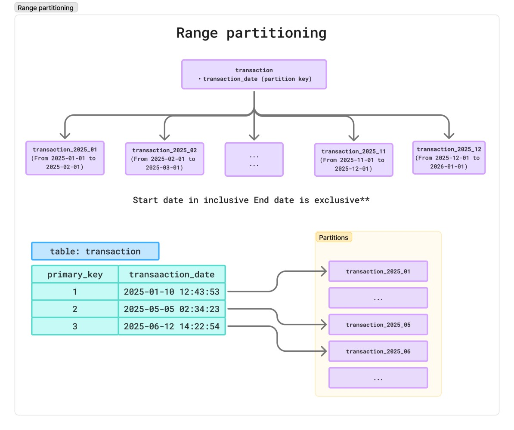
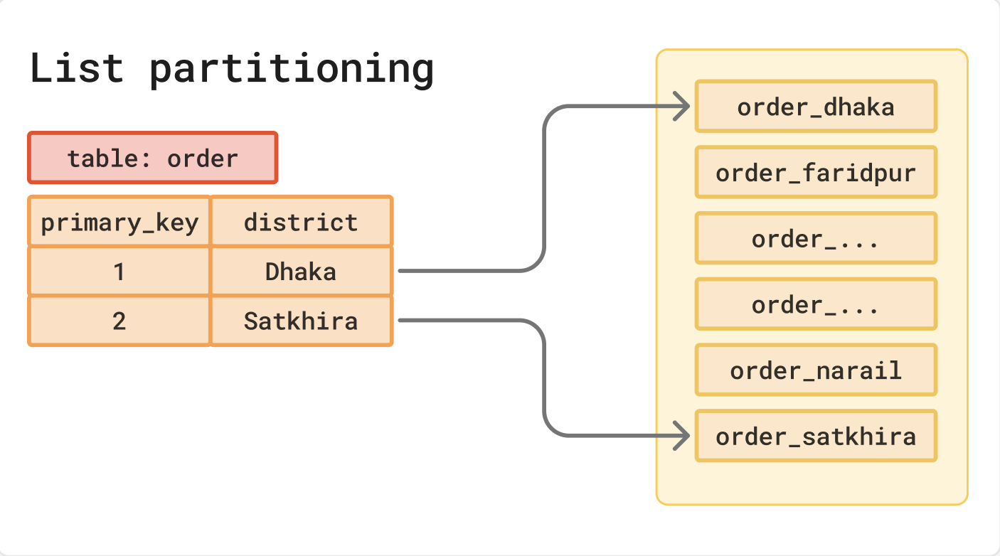
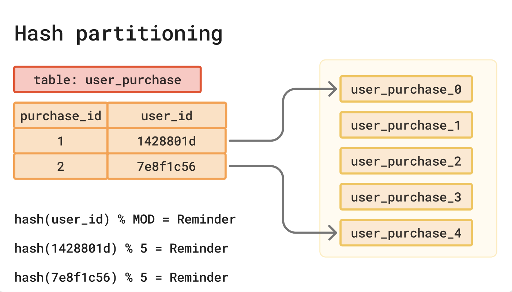

# Table Partitioning — কি, কেন এবং কখন?

প্রডাকশনে data-intensive সার্ভিস যখন billions of records store এবং retrieve হ্যান্ডেল করার জন্য ডিজাইন করা হয়, স্বাভাবিক ভাবেই সেই সার্ভিস গুলার table ডিজাইন অন্যান্য সার্ভিস গুলার থেকে বেশ কমপ্লেক্স হতে পারে। টেবিলের data growth rate হয় অনেক বেশি। Data বাড়ার সাথে সাথে query pattern সাধারণত না বদলালেও, query performance degrade করতে পারে, manageability কঠিন হয়ে পড়ে। আর সার্ভিস এর SLA (low latency, high uptime, correctness, freshness of data, এবং predictable data lifecycle) meet করা ক্রমশ চ্যালেঞ্জিং হয়ে ওঠে।

একটা খুব কমন উদাহরণ হতে পারে bank transaction সার্ভিস। যেখানে প্রতিদিন millions of transactions টেবিলে upsert হচ্ছে এবং বিভিন্ন product team যেমন loan, fraud detection, transaction insights ইত্যাদি সেই transaction নিয়ে কাজ করে। প্রথম দিকে সবকিছু ঠিকঠাক মনে হলেও, কিন্তু কয়েক মাস পরেই সমস্যাগুলো দেখা দেয়: write throughput, read throughput drop করে, পুরোনো data মুছতে গেলে সিস্টেম slow হয়ে পড়ে, প্রচুর bloating হয় টেবিলে আর প্ল্যাটফর্মের SLA মেনে চলা কষ্টকর হয়ে ওঠে। ঠিক এখানেই Table Partitioning একটি কার্যকর সমাধান হিসেবে কাজ করে।

## Table Partitioning কী?

Table Partitioning হলো একটা বড় টেবিলকে ছোট ছোট অংশে (Horizontally) ভাগ করে রাখা, যেগুলোকে বলা হয় partition। প্রতিটি partition আলাদা টেবিল হিসেবে store হয়, কিন্তু application বা query-এর কাছে পুরো জিনিসটা এখনও একটি টেবিল (parent table) হিসেবেই behave করে।

## Partitioning কেন দরকার?

1. **Range Partitioning**: Parent table কে এক বা একাধিক key column-এর range দিয়ে ভাগ করা। যেমন: একটা ডিজাইন হতে পারে একটা parent table কে কারেন্ট ইয়ার এর মাস অনুযায়ী ১২ টা partition table এ ভাগ করা, যার একেক টা টেবিলের রেঞ্জ হবে অই মাসের শুরুর আর শেষ তারিখ।

    

2. **List Partitioning**: Parent table কে নির্দিষ্ট value list দিয়ে ভাগ করা। যেমন: বাংলাদেশে মোট ৬৪টি জেলা রয়েছে, এখন district এর উপর ভিত্তি করে partition table design করা যেতে পারে, যেখানে district field এর ভ্যালু অনুযায়ী অই record টা নির্দিষ্ট অই ৬৪ টা টেবিলের কোন টায় থাকবে।

    

3. **Hash Partitioning**: Parent table কে HASH(key) % MODULUS == REMAINDER অনুযায়ী partition করা, runtime-এ "hash(key) % MODULUS" ক্যালকুলেট করে, এবং যে partition-এর REMAINDER মেলে সেখানে row রাউট করে; যেখানে 0 ≤ remainder < modulus। সাধারণত natural range/list না থাকলে even distribution এর জন্য এই টেকনিক ইউজ করা হয়।

    

## কখন বুঝবো Partitioning করা দরকার?

সব টেবিলে partitioning করলে সিস্টেম আসলে over-engineered হয়ে যাবে। তাই দরকার বুঝে partition করতে হয়।

Partitioning এর প্রয়োজনীয়তা বোঝার কিছু কমন টেকনিক হল:

1. **High Data Volume**: টেবিলে terabytes of records এবং index গুলার সাইজ ও GB/TB range এর।
2. **Query Performance Degrade**: Query pattern same থাকার পরেও response time increase হচ্ছে।
3. **High Data Ingestion Rate**: প্রতিদিন Millions of records upsert হচ্ছে এবং write throughput drop করতেছে, এবং ড্যাটাবেইজে internal lock বেশি হচ্ছে।
4. **Data Lifecycle Management**: Retention policy আছে (যেমন ১৩ মাসের পুরোনো data drop/achieve করতে হবে) এবং পুরোনো data purge করতে গিয়ে downtime বা slow performance হচ্ছে।
5. **Maintenance Overhead**: Vacuum, Analyze, ETL, Backup এর টাইম increase হচ্ছে।

নতুন সার্ভিস ডিজাইন এর সময় আমরা যদি উপরের বিষয়গুলো ধরতে পারি তাহলে আগে থেকেই partition নিয়েই ডিজাইন করা বেটার, তার না হলে মাঝপথে আমাদের data migration এর মাধ্যমে partition instroduce করতে হয়।

## Table Partitioning Strategy (PostgreSQL)

PostgreSQL built-in তিন ধরনের partitioning methods সাপোর্ট করে।

1. **Range Partitioning**: Parent table কে এক বা একাধিক key column-এর range দিয়ে ভাগ করা। যেমন: একটা ডিজাইন হতে পারে একটা parent table কে কারেন্ট ইয়ার এর মাস অনুযায়ী ১২ টা partition table এ ভাগ করা, যার একেক টা টেবিলের রেঞ্জ হবে অই মাসের শুরুর আর শেষ তারিখ।
2. **List Partitioning**: Parent table কে নির্দিষ্ট value list দিয়ে ভাগ করা। যেমন: বাংলাদেশে মোট ৬৪টি জেলা রয়েছে, এখন district এর উপর ভিত্তি করে partition table design করা যেতে পারে, যেখানে district field এর ভ্যালু অনুযায়ী অই record টা নির্দিষ্ট অই ৬৪ টা টেবিলের কোন টায় থাকবে।
3. **Hash Partitioning**: Parent table কে HASH(key) % MODULUS == REMAINDER অনুযায়ী partition করা, runtime-এ "hash(key) % MODULUS" ক্যালকুলেট করে, এবং যে partition-এর REMAINDER মেলে সেখানে row রাউট করে; যেখানে 0 ≤ remainder < modulus। সাধারণত natural range/list না থাকলে even distribution এর জন্য এই টেকনিক ইউজ করা হয়।

## Partition Key কি এবং কেন দরকার?

Partition Key হল সেই column(s) সেট যেটা দেখে database ঠিক করে কোন partition-এ একটি রো যাবে। এটাই insert/update-এর সময় tuple routing, query-র সময় partition pruning, আর maintenance (attach/detach/drop)–এর boundary নির্ধারণ করে।

### এটা কেন গুরুত্বপূর্ণ?

1. **Routing (INSERT/UPDATE)**: PARTITION BY-এ দেয়া key অনুযায়ী row সঠিক partition-এ চলে যায়। Ideally key should be immutable।
2. **Performance (Pruning)**: WHERE-এ key মিলে গেলে planner বাকি partitions skip করে latency ও I/O কমে।
3. **Maintenance Boundary**: Retention অনুযায়ী পুরো partition DETACH/DROP করা যায়, সো bulk DELETE এ vacuum overhead নেই।
4. **Constraints-এর নিয়ম**: Parent-এ PRIMARY KEY/UNIQUE দিলে partition key-এর সব কলাম থাকতে হবে (আর key-এ expression থাকলে parent-এ PK/UNIQUE দেয়া যাবে না)। তাই স্কিমা ডিজাইনে আগে থেকেই প্ল্যান করে নিতে হয়।

## Partition Pruning কি?

Partition pruning হলো database-এর এমন অপ্টিমাইজেশন যেখানে planner/executor Query'র শর্ত দেখে যেসব partition-এ ফল পাওয়ার সম্ভাবনা নেই সেগুলো স্ক্যানই করে না—ফলে I/O কমে, latency কমে। অন্যভাবে বললে, Query'র শর্ত মেলানো partitions-টাই শুধু স্ক্যান হয়—বাকিগুলো আগেই বাদ পড়ে, যাতে করে সার্চ স্পেস অনেক narrow হয়ে যায়।

## Partition Creation এর কিছু পদ্ধতি এবং Monitoring

-   **Manually (DDL স্ক্রিপ্ট)**: লিখে আমরা partition maintain করতে পারি, complex system যেখানে automation issue করতে পারে partition বানানোর জন্য, সেখানে বেটার engineer নিজে হ্যান্ডেল করা।
-   **PostgreSQL database এর জন্য pg_partman**: (recommended), কারণ pg_partman Time/ID ভিত্তিক partitioning, auto future partition create, retention ও rotation ম্যানেজ করতে হেল্প করে।
-   **Partition premake**: অথবা পুরনো partition detach/drop/archive করার জন্য pg_cron বা এক্সটার্নাল cron/GitHub Actions/K8s CronJob।
-   **Manual partition creation এর ক্ষেত্রে**: সিস্টেমে monitoring implement করা যাতে সে আগাম নোটিফাই করতে পারে partition run out হওয়ার আগে।

## Partitioning এর Best Practices

-   Partition key চয়েজ এর ক্ষেত্রে যেসব column সবচেয়ে বেশি WHERE-এ আসে সেখান থেকেই key নির্ধারণ করা অর্থাৎ Query pattern এর উপর ভিত্তি করে Partition key নির্ধারণ করা।
-   সঠিক Partition সংখ্যা ঠিক করার ক্ষেত্রে data volume, rate of growth, data life cycle বুঝে ডিজাইন করা, ফিউচার স্কেইল কে মাথায় রাখাও খুব গুরুত্বপূর্ণ।
-   Planner কয়েক হাজার partition সামলাতে পারে যদি pruning-এ বেশিরভাগ বাদ পড়ে।
-   Re-partitioning করা স্লো প্রসেস এবং ব্যয়বহুল, শুরুতেই workload simulation/benchmark করে Partitioning করা বেটার, বেশি partition বা কম partition কোনটা বেটার সেইটা বলা কঠিন, ডেটা ও কুয়েরি দেখে সিদ্ধান্ত নিতে হবে।
-   Data purging এর জন্য immutable date range partition better suitable, কারণ partition detach/delete partition will avoid table bloating।
-   High cardinality (অগণিত/অনেক ভ্যালু) কেসে Hash Partitioning বেটার চয়েস, কারণ Fixed partition count রেখে অসংখ্য key-কে even ভাবে ভাগ করে। আর per cardinality LIST করলে অনেক বেশি partition হবে।
-   Workload যদি টাইম-সেন্ট্রিক হয়, query তে date/time দিয়ে ফিল্টার আবশ্যক তখন বেটার চয়েস হবে Range based।

**হ্যাপি লার্নিং**
